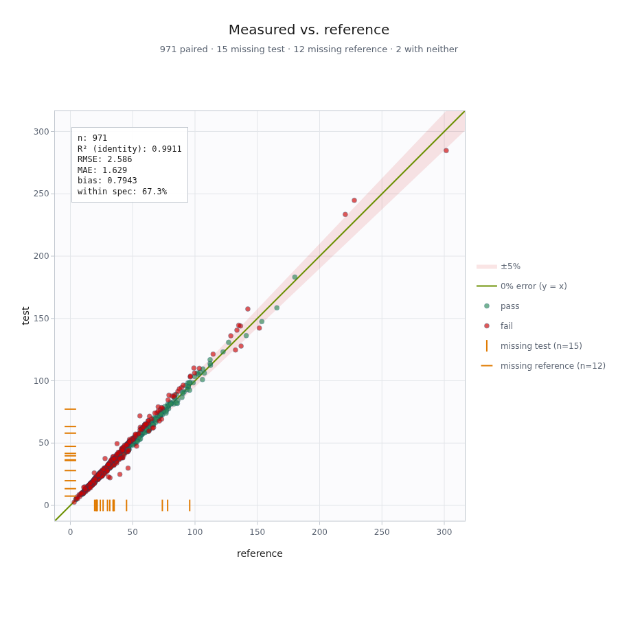
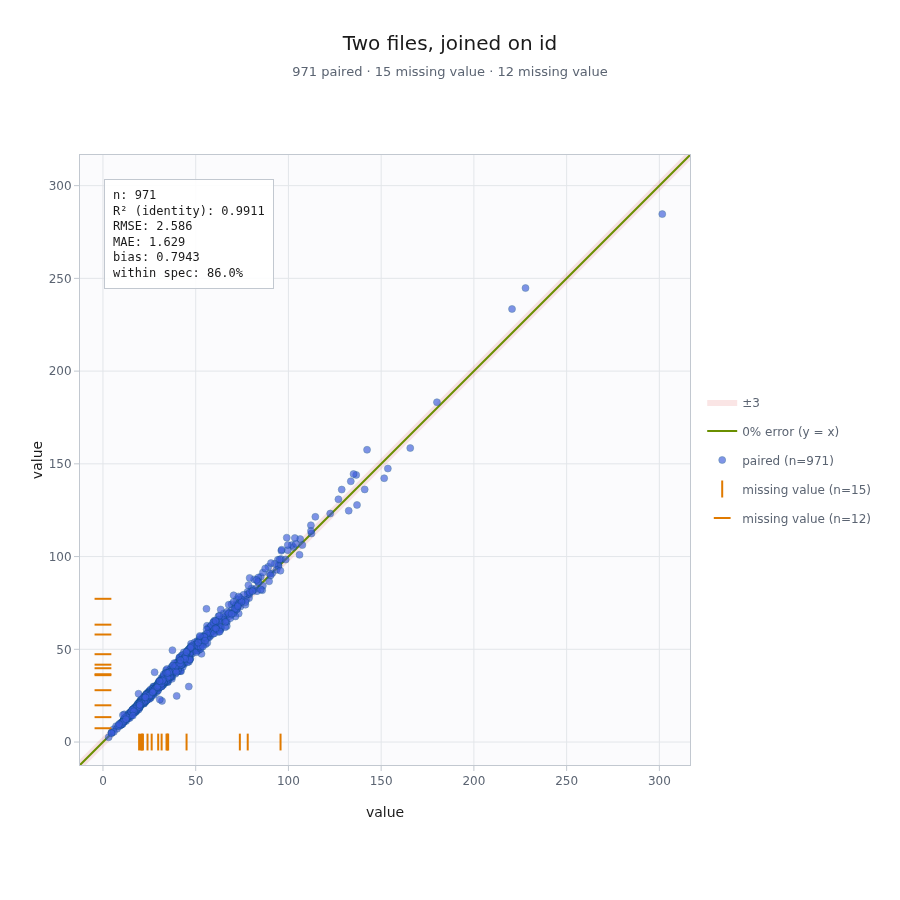
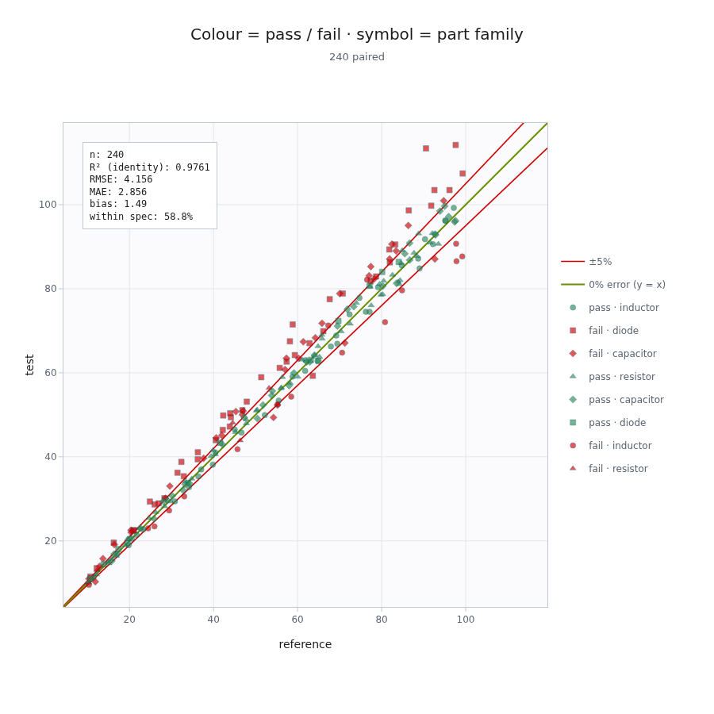

# parity-plot

**45° parity plots from Plotly** — as a Python package, a command-line tool, and
an interactive designer.

A parity plot scatters one dataset against another with a `y = x` identity line,
so you can see at a glance how well the two agree. `parity-plot` adds the things a
plain scatter leaves out: **tolerance bands** with pass/fail verdicts, **encoding**
by group or verdict, honest **identity-line statistics**, and first-class handling
of the case most tools ignore — records that exist in one dataset but have **no
counterpart** in the other.



```bash
uv run parity-plot example      # generate 1000 sample points, plot, open the browser
```

## Why it's more than a scatter plot

- **True 45°.** Both axes share one range and a 1:1 pixel scale, so `y = x` is a
  real 45° line on any window shape — not an approximation that drifts when the
  drawing area isn't square.
- **Tolerance bands that judge.** Add any number of named limits — a customer
  spec, a tighter internal target, a reference band nobody is graded against.
  Each paired point gets a `pass`/`fail` verdict, and the stats report the pass
  rate per criterion.
- **Encoding.** Colour and symbol are driven independently by the group column or
  the pass/fail verdict, so a plot can say "colour by part family, ✕ for
  failures" in one glance.
- **Unpaired records aren't dropped.** A value with no partner is drawn as a rug
  tick on the axis whose value is known — a data-quality signal, not silent loss.
- **Identity-line R².** Measured about `y = x`, not a best-fit line — the
  distinction that makes a parity plot meaningful (see [Statistics](#statistics)).
- **Live designer.** Edit every setting in a browser and watch the plot update,
  then save back to a commented TOML.

## Requirements & install

- Python `>=3.14`
- [`uv`](https://docs.astral.sh/uv/)

```bash
uv sync                    # everything, including the interactive designer
```

`png`/`svg`/`pdf` export additionally needs a headless Chrome for kaleido to
render into — `uv run plotly_get_chrome`. HTML output needs none of that.

## Quick start

```bash
uv run parity-plot example      # sample data → data/, render parity.html, open it
```

Both `example` and `plot` open the result by default; pass `--no-open-browser` to
suppress that, or `--no-plot` to skip rendering entirely.

```bash
uv run parity-plot plot data/example.csv --theme light --reltol 10pct
uv run parity-plot plot data/example.csv --no-open-browser -o quiet.html
```

## Data sources

Open any number of files. The two plotted series — **reference** and **test** —
are each picked as `file:column`, and must be numeric.

```bash
# both columns in one file (they pair by row order)
uv run parity-plot plot data.csv --ref 'data.csv:reference' --test 'data.csv:test'

# a column from each of two files, aligned on a join key
uv run parity-plot plot meas.csv sim.csv \
    --ref 'meas.csv:voltage' --test 'sim.csv:voltage' --join id

# a single file with no flags defaults ref/test to its first two numeric columns
uv run parity-plot plot data.csv
```



With `--join`, rows are outer-joined on that key, and a key on only one side is
unpaired. **Without a join, rows pair by position**, and the longer column's tail
is left unpaired.

A `--group COL` labels each point for the encoding below. Group is a **bare column
name**, not `file:column`: it names the joined *entity* (a part), so it may live
in one file or several. When two files both carry it, their values for a paired
record must agree — a mismatch is reported as an error naming the record and the
two values.

### Unpaired records

An unpaired record has only one coordinate, so it cannot be a point on the plot.
Dropping it silently would hide a real data-quality signal, so instead it is drawn
as a **rug mark on the axis of the value that is known**:

- a record with a reference but no measurement → tick along the x-axis
- a record with a measurement but no reference → tick along the y-axis

Counts appear in the subtitle. Unpaired records are excluded from the statistics,
since there is no difference to measure. Use `--nulls drop` to hide the rug marks
while still reporting the counts.

## Encoding

Marker **colour** and **symbol** are driven independently, each by one of
`single | pass-fail | group`. Below, **colour is the pass/fail verdict** (green =
pass, red = fail) and **each part family gets its own symbol** — so you read
whether a part is in spec from its colour and which family it belongs to from its
shape:



```toml
[plot.encoding]
color_by  = "pass-fail"   # single | pass-fail | group
symbol_by = "group"
# the symbols the groups cycle through (first-seen order, wraps if needed);
# omit for a built-in default cycle.
symbol_sequence = ["circle", "square", "diamond", "triangle-up"]
color     = "blue"        # the token used when color_by = single
symbol    = "circle"      # the symbol used when symbol_by = single
```

- **single** — every point the same colour/symbol.
- **pass-fail** — the overall verdict: pass = green, fail = red (or `○`/`✕`).
- **group** — by the group column: a colour palette, or a symbol cycle you can
  set with `symbol_sequence` (any Plotly symbol name, including `-open`/`-dot`
  variants; an unknown name is rejected with a named error).

Each distinct trace is one legend entry named for its meaningful dimensions —
`pass · inductor`, `fail · diode` — never for the raw glyph.

## Tolerances

A plot carries a **list** of named tolerances — a customer limit, a tighter
internal target, a reference band nobody is graded against. Each has:

| Attribute | Meaning |
| --- | --- |
| `name` | stable identifier, freeform |
| `abstol` | absolute tolerance, in the data's units — lines **parallel** to `y = x` |
| `reltol` | relative tolerance, a ratio (`0.1`) or `10pct` — a **wedge** through the origin |
| `kind` | `pass` (a criterion) or `info` (drawn for reference, never judged) |
| `color` | a token (`red`, `blue`, `green`, …) or a hex value |
| `style` | `lines` or `shaded` |
| `label` | legend text; `auto` derives it from the spec |

At least one of `abstol`/`reltol` is required. Given both, the permitted deviation
is the **looser** of the two — `max(abstol, reltol·|x|)` — so the envelope runs
parallel near the origin and flares into a funnel past the crossover, drawn as
real geometry rather than sampled.

The **parity line** (`y = x`) is itself the first, built-in tolerance: a
zero-width `info` entry named `parity`, drawn green, that cannot be deleted.

Each pass/fail tolerance judges every paired point. A point's verdict — `pass`, or
the names of the limits it failed — appears in the hover, the record table, and
the inspector. The statistics box reports the pass rate per criterion
(`within spec: 85.5%`); info tolerances are omitted.

```bash
# repeatable --tol, each a key=value spec
uv run parity-plot plot data.csv \
    --tol 'name=spec,reltol=10pct' \
    --tol 'name=tight,abstol=2,kind=info,color=blue,style=shaded'

# --abstol / --reltol stay as shorthand for a single tolerance
uv run parity-plot plot data.csv --abstol 2 --reltol 10pct
```

`--reltol` is a true ratio: `0.1` is a tenth, `10pct` says the same in percent,
and a bare `10` means ten times the reading — the unit is stated, never guessed.

## Python API

```python
from parity_plot import parity_plot

fig = parity_plot("data.csv", ref="data.csv:reference", test="data.csv:test")
fig = parity_plot("meas.csv", "sim.csv", ref="meas.csv:v", test="sim.csv:v", join="id")
fig = parity_plot(ref=[1.0, 2.0, 3.0], test=[1.1, None, 2.9], theme="light")
fig.show()
```

Any iterable of numbers works for `ref`/`test` — lists, pandas Series, numpy
arrays — with `None` or `NaN` marking a missing value. (No numpy or pandas
required; they're just accepted.)

## Config file

`uv run parity-plot init` writes a documented `parity.toml`. Every key has a
matching CLI flag, and **CLI flags win over the file, which wins over defaults**.

```toml
[data]
files = ["data/example.csv"]      # any number of files
ref   = "example.csv:reference"   # file:column, numeric
test  = "example.csv:test"
# join  = "id"                 # optional; omit to pair by row order
# group = "batch"              # optional; bare column name, file-independent

[plot]
theme = "dark"                 # dark | light
nulls = "rug"                  # rug | drop
legend = "right"               # right | bottom | none

[plot.encoding]
color_by  = "single"           # single | pass-fail | group
symbol_by = "single"

[[plot.tolerances]]            # a list; repeat the block for more
name = "spec"
reltol = 0.10                  # a ratio; "10pct" also accepted
# abstol = 2.0                 # and/or an absolute bound
kind = "pass"                  # pass | info
color = "red"
style = "lines"                # lines | shaded

[output]
path = "parity.html"
format = "html"                # html | png | svg | pdf
```

```bash
uv run parity-plot plot -c parity.toml
uv run parity-plot plot -c parity.toml --theme light   # flag overrides the file
```

## Interactive designer

```bash
uv run parity-plot design data/example.csv -c parity.toml
```

Opens a local browser app: edit any setting and the plot updates live, then save
back to the TOML. Comments in an existing config survive the round trip, and a key
you have not changed keeps its original spelling (`reltol = "10pct"` is not
rewritten as `0.1`).

The preview is produced by the same `build_figure` the CLI uses, so what you see
is exactly what `parity-plot plot -c parity.toml` will render — an equivalence
pinned by a test, not assumed. Saving refuses to overwrite a config that changed
on disk since it was opened, so an edit made in another window is not silently
discarded. **Errors surface in a persistent status bar under the plot**, never a
disappearing pop-up.

- **Data panel** — open any CSV and map its columns; the designer reads just the
  header to offer choices and guesses the mapping from names seen in the wild
  (`reference`/`measured`, `expected`/`actual`, `golden`/`dut`).
- **Inspector** — click any point (or a rug tick) to see both values, the signed
  and relative error, and whether it passes the current tolerance.
- **Table** — every visible record, sortable by any column, so "which parts are
  furthest out of spec" is one click. Selecting a row highlights the point and
  vice-versa.
- **Filters** — *Failures only* and *Include unpaired* narrow the plot, table and
  stats together; the count reads `showing 14 of 1,000` whenever anything is
  hidden. Filters are exploration state and are never written to the config.

## Statistics

`R²` is measured **about the identity line**, not about a least-squares fit:

```
R² = 1 - Σ(y - x)² / Σ(y - ȳ)²
```

This matters. Data on a tight line parallel to `y = x` has a best-fit R² of 1.0
while agreeing with nothing; only the identity form exposes that. Pearson *r* is
reported separately for the correlation question. Also computed: RMSE, MAE, bias
(mean signed error), max absolute error, and the fraction of points inside each
tolerance band.

## Shaping the example data

The `example` generator is adjustable, so you can watch the plot respond:

```bash
uv run parity-plot example --noise 0.25 --bias 0.10    # sloppy and skewed
uv run parity-plot example --noise 0.01 --outliers 0   # tight and clean
uv run parity-plot example --missing-x 100 --missing-y 100   # lots of unpaired records
```

| Flag | Meaning | Default |
| --- | --- | --- |
| `-n/--count` | Number of records | 1000 |
| `--seed` | Same seed → same data | 17 |
| `--x-min` / `--x-max` | Reference range (central 95% of draws) | 10 – 100 |
| `--bias` | Systematic slope error, as a fraction | 0.015 |
| `--noise` | Gaussian scatter proportional to the value | 0.06 |
| `--noise-floor` | Gaussian scatter in absolute units | 0.4 |
| `--outliers` | Fraction thrown far off the line | 0.01 |
| `--missing-y` / `--missing-x` / `--both-null` | Unpaired record counts | 1.5% / 1.2% / 0.2% of `-n` |

Fractions rather than percentages. The null counts scale with `-n` so a small `-n`
still works; pass explicit counts to override.

## Tests

```bash
uv run pytest
```
