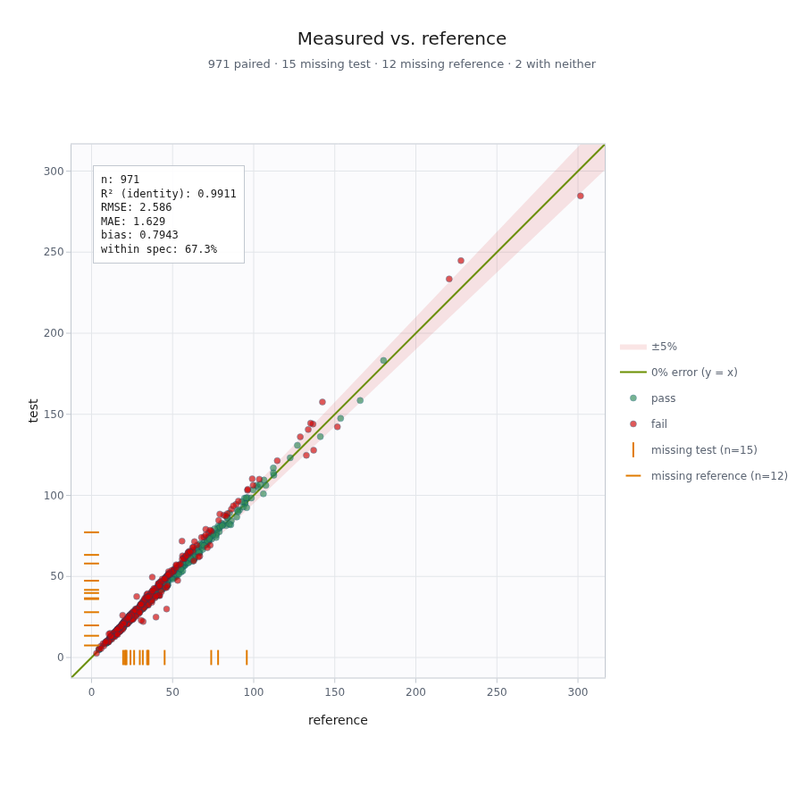
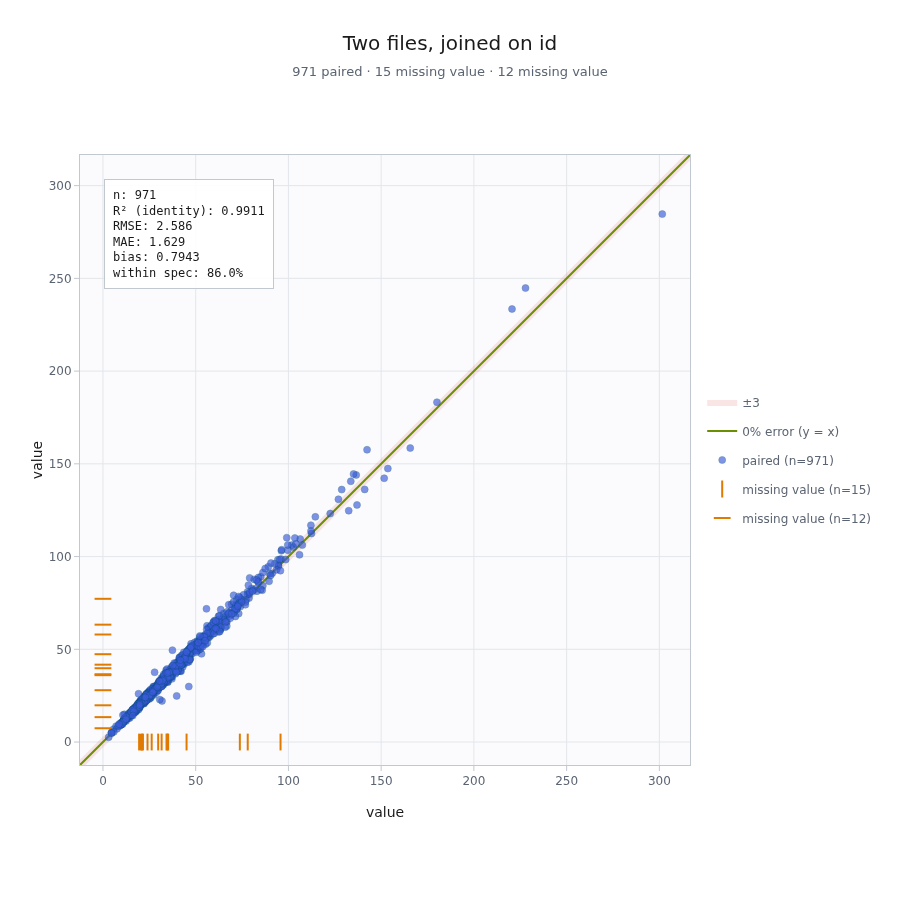
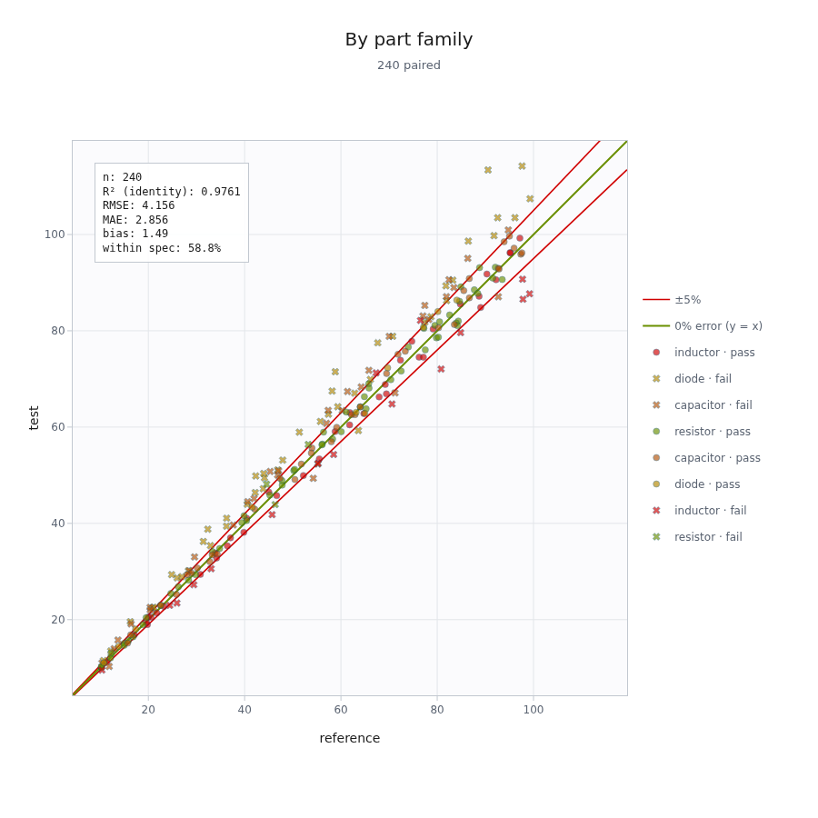
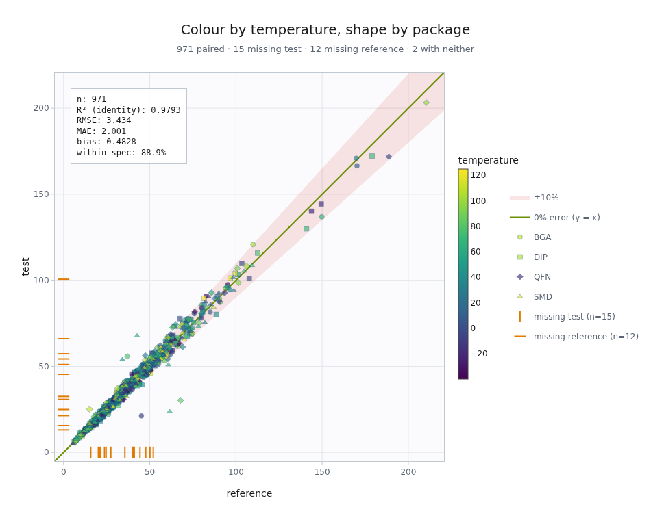

# parity-plot

**45° parity plots from Plotly** — as a Python package, a command-line tool, and
an interactive designer.

A parity plot scatters one dataset against another with a `y = x` identity line,
so you can see at a glance how well the two agree. `parity-plot` adds the things a
plain scatter leaves out: **tolerance bands** with pass/fail verdicts,
**polynomial reference lines**, **encoding** by group or verdict, honest
**identity-line statistics**, and first-class handling
of the case most tools ignore — records that exist in one dataset but have **no
counterpart** in the other.



```bash
uv run parity-plot example      # generate 1000 sample points, plot, open the browser
```

## Why it's more than a scatter plot

- **True 45°.** Both axes share one range and a 1:1 pixel scale, so `y = x` is a
  real 45° line on any window shape — not an approximation that drifts when the
  drawing area isn't square.
- **Tolerance bands that judge.** Add any number of named limits — a customer
  spec, a tighter internal target, a reference band nobody is graded against.
  Each paired point gets a `pass`/`fail` verdict, and the stats report the pass
  rate per criterion.
- **Polynomial reference lines.** Overlay any number of equations, with selectable
  colour and solid, dashed or dotted strokes.
- **Encoding.** Colour and symbol are driven independently by the group column or
  the pass/fail verdict, so a plot can say "colour by part family, ✕ for
  failures" in one glance.
- **Unpaired records aren't dropped.** A value with no partner is drawn as a rug
  tick on the axis whose value is known — a data-quality signal, not silent loss.
- **Delta histogram.** Optionally add a lower histogram of signed paired
  differences (`test - reference`) to see bias and spread without leaving the
  parity plot.
- **Identity-line R².** Measured about `y = x`, not a best-fit line — the
  distinction that makes a parity plot meaningful (see [Statistics](#statistics)).
- **Live designer.** Edit every setting in a browser and watch the plot update,
  then save back to a commented TOML.

## Requirements & install

- Python `>=3.14`
- [`uv`](https://docs.astral.sh/uv/)

```bash
uv sync                    # everything, including the interactive designer
```

`png`/`svg`/`pdf` export additionally needs a headless Chrome for kaleido to
render into — `uv run plotly_get_chrome`. HTML output needs none of that.

## Quick start

```bash
uv run parity-plot example      # sample data → data/, render parity.html, open it
```

Both `example` and `plot` open the result by default; pass `--no-open-browser` to
suppress that, or (for `example`) `--no-plot` to skip rendering entirely.

**`plot` is TOML-driven.** Everything about how a plot looks — data columns, theme,
tolerances, reference lines, encoding — lives in a config file, not on the command
line. Start one, edit it, render it:

```bash
uv run parity-plot init                 # write a documented parity.toml
uv run parity-plot plot                 # render it (CONFIG defaults to ./parity.toml)
uv run parity-plot plot my.toml -o quiet.html --no-open-browser
```

The only `plot` flags are operational: `-o/--output` (where to write) and
`--open-browser`. To explore the surface, `parity-plot --help` and each
subcommand's `--help`; to shape a plot, edit the TOML (below) or use the designer.

## Data sources

Open any number of files. The two plotted series — **reference** and **test** —
are each picked as `file:column`, and must be numeric. This lives in `[data]`:

```toml
[data]
# both columns in one file → they pair by row order
files = ["data.csv"]
ref   = "data.csv:reference"
test  = "data.csv:test"

# — or — a column from each of two files, aligned on a join key:
# files = ["meas.csv", "sim.csv"]
# ref   = "meas.csv:voltage"
# test  = "sim.csv:voltage"
# join  = "id"
```



With `join`, rows are outer-joined on that key, and a key on only one side is
unpaired. **Without a join, rows pair by position**, and the longer column's tail
is left unpaired. Join keys must be unique in every participating file. The two
axis files, the pinned `color_column` file, and every file that supplies a chosen
group column must carry the join column; ambiguous or unalignable auxiliary data
raises instead of silently choosing or dropping values.

`group` labels each point for the encoding below. It is one **or more** bare column
names (not `file:column`): a group names the joined *entity* (a part), so it may
live in one file or several, and several columns compose into one label —
`group = ["package", "vendor"]` reads as `"SMD, Acme"`. When two files both carry a
group column, their values for a paired record must agree — a mismatch is an error
naming the record and the two values. With joined data, every file that carries a
selected group column must also carry the join column.

A separate `color_column` (a single numeric `file:column`) drives the *colorscale*
colour mode — see [Encoding](#encoding). Unlike `group`, it is pinned to one file,
since the same column can legitimately differ between the reference and test files.

### Hover text

Hovering a point always shows its key, both axis values, their difference and the
tolerance verdict. Everything else in the row can be shown too — by default,
**it already is**:

```
S0000
reference: 11.01
test: 11.33
difference: +0.3209
package: BGA
vendor: Acme
temperature: 111.3864
pass
```

The extra rows come from `hover_columns`, whose default is every *other* column
of the files backing `ref` and `test`:

```toml
[data]
# hover_columns = ["example.csv:package", "example.csv:temperature"]
```

- **Omit the key** for the default: all the context in those files, so you rarely
  have to configure anything.
- **Give a list** to pin exactly those columns, in that order. They are
  `file:column` refs, so a column present in both files can be shown from each —
  the hover labels them `reference.csv:temperature` and `measured.csv:temperature`
  only when it would otherwise be ambiguous.
- **Give `[]`** for no extra rows.

`ref`, `test` and the `join` column are never candidates: the hover already shows
all three, as the two axis rows and the bold key line. A third open file is not a
candidate either — without a join into it, its rows cannot be aligned to a point.
Cells are shown as the file's own text, so `111.3864` hovers exactly as written;
per-column number formatting is not yet configurable.

### Unpaired records

An unpaired record has only one coordinate, so it cannot be a point on the plot.
Dropping it silently would hide a real data-quality signal, so instead it is drawn
as a **rug mark on the axis of the value that is known**:

- a record with a reference but no measurement → tick along the x-axis
- a record with a measurement but no reference → tick along the y-axis

Counts appear in the subtitle. Unpaired records are excluded from the statistics,
since there is no difference to measure. Set `nulls = "drop"` in `[plot]` to hide
the rug marks while still reporting the counts.

## Encoding

Marker **colour** and **symbol** are driven independently. Symbol is one of
`single | pass-fail | group`; colour adds a fourth mode, `colorscale`. Below,
**colour is the pass/fail verdict** (green = pass, red = fail) and **each part
family gets its own symbol** — so you read whether a part is in spec from its
colour and which family it belongs to from its shape:



```toml
[plot.encoding]
color_by  = "pass-fail"   # single | pass-fail | group | colorscale
symbol_by = "group"       # single | pass-fail | group
# the symbols the groups cycle through (first-seen order, wraps if needed);
# omit for a built-in default cycle.
symbol_sequence = ["circle", "square", "diamond", "triangle-up"]
color     = "blue"        # the token used when color_by = single
symbol    = "circle"      # the symbol used when symbol_by = single
```

- **single** — every point the same colour/symbol.
- **pass-fail** — the overall verdict: pass = green, fail = red (or `○`/`✕`).
- **group** — by the group column: a colour palette, or a symbol cycle you can
  set with `symbol_sequence` (any Plotly symbol name, including `-open`/`-dot`
  variants; an unknown name is rejected with a named error).
- **colorscale** *(colour only)* — a **continuous colorbar** driven by a numeric
  column. Point `[data].color_column` at the column and pick any Plotly named
  scale. Colour then rides a colorbar (not the legend), so it composes with a
  symbol channel: colour = temperature, shape = package.



```toml
[data]
color_column = "example.csv:temperature"   # a single numeric file:column

[plot.encoding]
color_by   = "colorscale"
colorscale = "viridis"    # any Plotly named scale: plasma, turbo, cividis, …
symbol_by  = "group"      # colour = temperature, shape = part family
```

Each distinct trace is one legend entry named for its meaningful dimensions —
`pass · inductor`, `fail · diode` — never for the raw glyph. Under `colorscale`
the colour is shown by the colorbar, so a trace is named for its symbol group
alone (`BGA`, `DIP`), and the colour never appears in the legend.

## Tolerances

A plot carries a **list** of named tolerances — a customer limit, a tighter
internal target, a reference band nobody is graded against. Each has:

| Attribute | Meaning |
| --- | --- |
| `name` | stable identifier, freeform |
| `abstol` | absolute tolerance, in the data's units — lines **parallel** to `y = x` |
| `reltol` | relative tolerance, a ratio (`0.1`) or `10pct` — a **wedge** through the origin |
| `kind` | `pass` (a criterion) or `info` (drawn for reference, never judged) |
| `color` | a token (`red`, `blue`, `green`, …) or a hex value |
| `style` | `lines` or `shaded` |
| `label` | legend text; `auto` derives it from the spec |

At least one of `abstol`/`reltol` is required. Given both, the permitted deviation
is the **looser** of the two — `max(abstol, reltol·|x|)` — so the envelope runs
parallel near the origin and flares into a funnel past the crossover, drawn as
real geometry rather than sampled.

The **parity line** (`y = x`) is itself the first, built-in tolerance: a
zero-width `info` entry named `parity`, drawn green, that cannot be deleted.

Each pass/fail tolerance judges every paired point. A point's verdict — `pass`, or
the names of the limits it failed — appears in the hover, the record table, and
the inspector. The statistics box reports the pass rate per criterion
(`within spec: 85.5%`); info tolerances are omitted.

```toml
# a list; repeat the block for each named limit
[[plot.tolerances]]
name   = "spec"
reltol = "10pct"

[[plot.tolerances]]
name   = "tight"
abstol = 2
kind   = "info"
color  = "blue"
style  = "shaded"
```

`reltol` is a true ratio: `0.1` is a tenth, `10pct` says the same in percent,
and a bare `10` means ten times the reading — the unit is stated, never guessed.

## Polynomial reference lines

Reference lines are independent of tolerance grading. Repeat the table to overlay
several polynomials:

```toml
[[plot.polynomial_lines]]
coefficients = [2, -3, 0, 4]
color = "orange"
style = "dashed"               # solid | dashed | dotted
```

Coefficients are ordered from highest degree to constant. This example is
`y = 2x^3 - 3x^2 + 4`; zero-coefficient terms are omitted from the legend. The
designer accepts the same coefficients as comma-separated text: `2, -3, 0, 4`.
Colours use the theme tokens `red`, `yellow`, `orange`, `green`, `blue`, `purple`,
`magenta`, `grey`, or a hex value in TOML/Python. Coefficients must be finite;
an all-zero polynomial is shown as `y = 0`. Legend and editor text preserve the
stored float precision. Reference lines never change the default, data-derived
viewport. To choose its lower-left corner explicitly, set either origin:

```toml
[plot]
x_origin = 0
y_origin = 0
```

Origins are expressed in data units; log axes require positive values. Omit
either key to keep that axis automatic. With **Lock 45°** enabled and unequal
origins, parity-plot extends the shorter range's upper edge so both axes keep
the same span without moving either requested origin.

## Python API

```python
from parity_plot import parity_plot
from parity_plot.encoding import Encoding
from parity_plot.polynomial_lines import PolynomialLine

fig = parity_plot("data.csv", ref="data.csv:reference", test="data.csv:test")
fig = parity_plot("meas.csv", "sim.csv", ref="meas.csv:v", test="sim.csv:v", join="id")
fig = parity_plot(ref=[1.0, 2.0, 3.0], test=[1.1, None, 2.9], theme="light")
fig = parity_plot(
    ref=[1.0, 2.0, 3.0],
    test=[1.1, 2.2, 2.9],
    group=["control", "trial", "trial"],
)
fig = parity_plot(
    ref=[1.0, 2.0, 3.0],
    test=[1.1, 2.2, 2.9],
    polynomial_lines=(PolynomialLine((2, 0, -1), style="dotted"),),
)

# group takes one or more column names; keyword options are PlotConfig fields
fig = parity_plot(
    "parts.csv",
    ref="parts.csv:sim",
    test="parts.csv:measured",
    group=["package", "vendor"],
    encoding=Encoding(color_by="pass-fail", symbol_by="group"),
)
fig.show()
```

Any iterable of numbers works for `ref`/`test` — lists, pandas Series, numpy
arrays — with `None` or `NaN` marking a missing value. (No numpy or pandas
required; they're just accepted.) Other non-finite values are rejected. For
in-memory data, `group` is a sequence aligned with `ref` and `test`; a bare string
is rejected because it cannot unambiguously mean one label per point. Keyword
`options` are `PlotConfig` fields (`theme`, `legend`, `encoding`, …); an unknown
one is rejected.

### Driving the API from a config file

A TOML config is a complete instruction — pass it and nothing else:

```python
fig = parity_plot(config="lab/run7.toml")  # data, encoding, tolerances, all of it
fig = parity_plot(config="lab/run7.toml", theme="dark")  # keywords win over the file
fig = parity_plot(config=cfg, ref="meas.csv:v2")  # or a ParityConfig, partly overridden
```

So a plot can be **defined once in a committed TOML** and rendered by the CLI,
the designer, or your own code, with no chance of the three disagreeing.

## Embedding in an app

To put several plots in one page, don't ship a standalone document each — they'd
carry a copy of plotly.js apiece. Write **fragments** and let the page load the
library once:

```python
from parity_plot import parity_plot, to_fragment

frag = to_fragment(parity_plot(config="run7.toml"), div_id="parity-run7")
```

A fragment is a `<div>` plus its `<script>`, no `<html>` wrapper. It carries only
your data, so its size scales with the point count — a few KB for a small plot,
~77 KB for a thousand points — against a flat **4.9 MB** of library in every
standalone inlined file. Ten plots: ~0.8 MB of fragments plus one shared library,
versus 49 MB. Or straight from a config, via `[output]`:

```toml
[output]
path = "site/_includes/run7.html"
embed = true                       # plotlyjs defaults to "none" when embedding
div_id = "parity-run7"             # pin it, or cached output churns on a random UUID
```

For a **dynamic** app, skip HTML entirely: `parity_plot(...)` returns a plain
Plotly figure, so `fig.to_json()` on the server and `Plotly.newPlot(div, data,
layout)` on the client ships only the data.

The library itself is minified (`plotly.min.js`, 4.85 MB) and already sits in the
plotly wheel — copy it out rather than fetching it, and it is guaranteed to match
the version that rendered your figures:

```bash
uv run python -c "import plotly, pathlib, shutil; \
shutil.copy(pathlib.Path(plotly.__file__).parent / 'package_data' / 'plotly.min.js', \
            'static/plotly.min.js')"
```

**→ [`examples/tabbed-report/`](examples/tabbed-report/) is a complete working
app** — three plots in a tabbed static page, one shared library, no server:

```bash
uv run examples/tabbed-report/build-report        # → dist/index.html
```

**→ [docs/embedding.md](docs/embedding.md) is the full guide**, and worth reading
before wiring this up. It covers the failure modes that are silent rather than
loud, each verified against the real output:

- a fragment is `height: 100%`, so a container without a **definite height**
  renders nothing, with no console error;
- fragments run from a plain inline `<script>`, so loading plotly.js with
  `defer` or `type="module"` gives `Plotly is not defined`;
- **`innerHTML` never executes inline scripts**, so runtime-injected fragments
  are permanently blank — dynamic apps must use `to_json()`;
- `responsive: true` is already set, so window resizes are handled, but
  container-only resizes need `Plotly.Plots.resize` — and a stale layout breaks
  the 45° geometry *silently*;
- above 5,000 points traces become `scattergl`, and browsers cap live WebGL
  contexts at roughly 8–16, so a page of large plots starts rendering blank.

## Config file

`uv run parity-plot init` writes a documented `parity.toml`. **The TOML is the
single source of truth for how a plot looks** — the CLI has no appearance flags; it
only chooses which config to render (`parity-plot plot CONFIG`) and where to write
it (`-o`). Unknown keys raise, so a typo never silently renders the default.

```toml
[data]
files = ["data/example.csv"]      # any number of files
ref   = "example.csv:reference"   # file:column, numeric
test  = "example.csv:test"
# join  = "id"                     # optional; omit to pair by row order
# group = ["package", "vendor"]    # optional; one or more bare column names
# color_column = "example.csv:temperature"  # optional; numeric, for colorscale
# hover_columns = ["example.csv:package"]   # optional; omit for every other
#                                  # column of the ref/test files, [] for none

[plot]
theme = "dark"                 # dark | light
nulls = "rug"                  # rug | drop
legend = "right"               # right | bottom | none
delta_histogram = false        # true adds a lower histogram of test - ref
delta_histogram_bins_auto = true
# delta_histogram_bins = 25     # odd; used when auto buckets are off
delta_histogram_bucket_labels = false
delta_histogram_sigma_lines = false
delta_histogram_log_y = false
# x_origin = 0                 # optional left edge; omit for automatic
# y_origin = 0                 # optional bottom edge; log axes require > 0

[plot.encoding]
color_by  = "single"           # single | pass-fail | group | colorscale
symbol_by = "single"           # single | pass-fail | group
# colorscale = "viridis"       # any Plotly named scale; used by color_by = colorscale

[[plot.tolerances]]            # a list; repeat the block for more
name = "spec"
reltol = 0.10                  # a ratio; "10pct" also accepted
# abstol = 2.0                 # and/or an absolute bound
kind = "pass"                  # pass | info
color = "red"
style = "lines"                # lines | shaded

[[plot.polynomial_lines]]       # coefficients: highest degree to constant
coefficients = [2, -3, 0, 4]   # legend: y = 2x^3 - 3x^2 + 4
color = "orange"
style = "dashed"               # solid | dashed | dotted

[output]
path = "parity.html"
# format comes from the extension — `path = "shot.png"` writes a PNG. Set it only
# to override, and never to something the extension contradicts (that raises).
# format = "html"              # html | png | svg | pdf
# plotlyjs = "inline"          # inline | cdn | directory — see Offline use
# width = 900                   # positive integers only
# height = 900
```

```bash
uv run parity-plot plot                 # renders ./parity.toml
uv run parity-plot plot lab/run7.toml   # or any path you name
```

### Offline use

Everything works with no network, by design:

- **Exported HTML inlines plotly.js** (`[output].plotlyjs = "inline"`, the
  default), so the file opens on an air-gapped machine, survives being emailed,
  and still renders years later when that CDN build is gone. It costs ~4.8 MB per
  file. Set `plotlyjs = "cdn"` for an 84 KB file that needs a network,
  `"directory"` to write `plotly.min.js` once beside the HTML and share it across
  every plot in that folder, or `"none"` for a page that loads its own (see
  [Embedding in an app](#embedding-in-an-app)).
- **The designer** serves its own assets — no CDN.
- **`png`/`svg`/`pdf` export** drives a local headless Chrome
  (`uv run plotly_get_chrome`), which is the only piece you have to fetch, once.

## Interactive designer

```bash
uv run parity-plot design data/example.csv -c parity.toml
```

Opens a local browser app: edit any setting and the plot updates live. **Edits
auto-save** to the bound config — a top toolbar carries a config dropdown (the
parity `.toml`s in the launch directory), **Save As**, and **New Design**. Pick a
config to open it; every valid edit is written straight to it, so the file on disk
always holds the latest valid config. A `‹unsaved›` design (New Design, or a
data-only launch) writes nowhere until **Save As** binds it a name. Comments in an
existing config survive the round trip, and a key you have not changed keeps its
original spelling (`reltol = "10pct"` is not rewritten as `0.1`).

`--config` may point outside the launch directory. That bound file remains the
active picker entry while the dropdown also offers valid parity configs from the
launch directory.

The preview is produced by the same `build_figure` the CLI uses, so what you see
is exactly what `parity-plot plot parity.toml` will render — an equivalence pinned
by a test, not assumed. **Problems are flagged in place.** A blocking error (a
setting that would produce a broken config) reddens the field, disables Save As,
and withholds the auto-save, so a broken config never reaches disk. A non-blocking
advisory — e.g. a join column while `ref` and `test` come from one file, which is
merely *redundant* (they already pair by row) — shows an amber note without
stopping anything. **Both surface in a persistent status bar under the plot**,
never a disappearing pop-up.

The settings sidebar and results column scroll independently. Long configuration
panels can therefore be edited without moving the plot out of view. On narrow
screens, the plot stays above the scrolling settings instead of being squeezed
off-screen.

Under **Appearance → Viewport Origin**, choose **Auto** for data-derived bounds,
**0,0** to pin both lower bounds to zero, or **Custom** to use the adjacent X/Y
values. The custom fields are pre-filled with the bounds currently used by the
plot and remain in data units, including on logarithmic axes.

- **Data panel** — open any CSV and map its columns; the designer reads just the
  header to offer choices and guesses the mapping from names seen in the wild
  (`reference`/`measured`, `expected`/`actual`, `golden`/`dut`).
- **Reference lines** — add, edit and remove polynomial overlays; enter coefficients
  as comma-separated text from highest degree to constant, and choose colour and
  stroke style.
- **Inspector** — click any point (or a rug tick) to see both values, the signed
  and relative error, and whether it passes the current tolerance.
- **Table** — every visible record, sortable by any column, so "which parts are
  furthest out of spec" is one click. Selecting a row highlights the point and
  vice-versa.
- **Filters** — *Failures only* and *Include unpaired* narrow the plot, table and
  stats together; the count reads `showing 14 of 1,000` whenever anything is
  hidden. Filters are exploration state and are never written to the config.

## Statistics

`R²` is measured **about the identity line**, not about a least-squares fit:

```
R² = 1 - Σ(y - x)² / Σ(y - ȳ)²
```

This matters. Data on a tight line parallel to `y = x` has a best-fit R² of 1.0
while agreeing with nothing; only the identity form exposes that. Pearson *r* is
reported separately for the correlation question. Also computed: RMSE, MAE, bias
(mean signed error), max absolute error, and the fraction of points inside each
tolerance band.

## Shaping the example data

The `example` generator is adjustable, so you can watch the plot respond:

```bash
uv run parity-plot example --noise 0.25 --bias 0.10    # sloppy and skewed
uv run parity-plot example --noise 0.01 --outliers 0   # tight and clean
uv run parity-plot example --missing-x 100 --missing-y 100   # lots of unpaired records
```

| Flag | Meaning | Default |
| --- | --- | --- |
| `-n/--count` | Number of records | 1000 |
| `--seed` | Same seed → same data | 17 |
| `--x-min` / `--x-max` | Reference range (central 95% of draws) | 10 – 100 |
| `--bias` | Systematic slope error, as a fraction | 0.015 |
| `--noise` | Gaussian scatter proportional to the value | 0.06 |
| `--noise-floor` | Gaussian scatter in absolute units | 0.4 |
| `--outliers` | Fraction thrown far off the line | 0.01 |
| `--missing-y` / `--missing-x` / `--both-null` | Unpaired record counts | 1.5% / 1.2% / 0.2% of `-n` |

Fractions rather than percentages. The null counts scale with `-n` so a small `-n`
still works; pass explicit counts to override.

## Documentation and development

- [Embedding guide](docs/embedding.md) — static fragments, dynamic JSON, sizing,
  resize handling, and WebGL limits.
- [Tabbed report example](examples/tabbed-report/) — a complete offline page with
  three plots and one shared Plotly library.
- [Documentation index](docs/README.md) — current guides versus historical design
  and implementation records.

```bash
uv sync
./check-tier-1                    # fast: lint, types, eight smoke tests
./check-tier-2                    # release/request: full suite, wheel, example
./run-check                       # open the designer against data/parts.csv
```

GitHub Actions runs Tier 1 for pull requests and updates to `main`. Tier 2 runs
only for `v*` release tags or when selected through **Run workflow**. Tier 2 is a
superset: it reruns Tier 1, executes the complete test suite, builds the package,
smokes the wheel in an isolated environment, and builds the documented tabbed
report.
