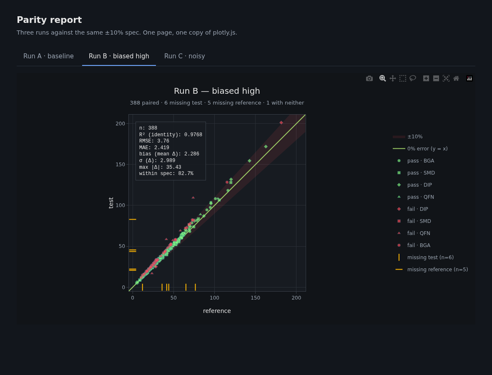
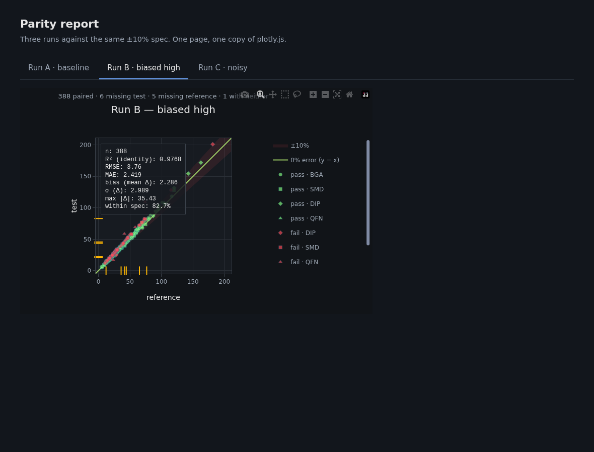

# Example: a static tabbed parity report

A complete, minimal consumer app. Three parity plots, three tabs, one static HTML
file that opens with no server and no network.

```bash
uv run python examples/tabbed-report/build.py
# → dist/index.html  (120 KB for 3 plots)
#   dist/static/plotly.min.js  (4.85 MB, shared by all of them)
```



Read [`docs/embedding.md`](../../docs/embedding.md) for the reasoning. This is
that document made executable.

## Layout

```
configs/run-{a,b,c}.toml   the plot definitions — committed, one per run
templates/page.html        the page shell: tabs, CSS, tab JS
build.py                   generates data, renders fragments, assembles the page
data/                      generated CSVs           (gitignored)
dist/                      the built report         (gitignored)
```

The split is the point. A **config defines a plot** and nothing else, so
`parity-plot plot configs/run-a.toml` and `parity-plot design configs/run-a.toml`
show you exactly what the report will show. The **app owns presentation** — which
div id, which tab label, where the file lands. Neither knows about the other.

## What it demonstrates

**One library for three plots.** Each plot is a *fragment* — a `<div>` and its
`<script>`, no plotly.js — and the page loads the library once. 120 KB of
fragments plus one 4.85 MB library, against ~14.8 MB as three standalone files.
The saving grows with every plot you add.

**The library is copied out of the installed plotly wheel**, not fetched from a
CDN. It works offline, and it is guaranteed to be the version that rendered the
figures.

**Fragments, because this page is built ahead of time.** An app that inserted
plots *after* load would have to use `fig.to_json()` instead: inline scripts added
via `innerHTML` never execute, so a runtime-injected fragment is a permanently
blank div with nothing in the console.

**Definite panel heights.** A fragment is `height: 100%`, and 100% of a
`height: auto` parent is zero. `templates/page.html` gives each panel
`height: 620px`.

**A plain `<script src>` for the library.** Fragments draw themselves from inline
scripts that run at parse time; `defer` or `type="module"` would leave the library
still queued and every plot would die with `Plotly is not defined`.

**Deterministic output.** Every fragment gets an explicit `div_id`, so rebuilding
unchanged input produces a byte-identical page — verified in the test. Without it
plotly invents a UUID per div and content hashing is defeated.

**Resize on tab reveal — the one that bites.** A hidden panel is `display:none`,
so its plot was laid out at zero size. Revealing it does not re-lay it out:

| with `Plotly.Plots.resize` | without it |
|---|---|
|  |  |

Not blank, and nothing throws — just wrong. Undersized, the subtitle colliding
with the modebar, and three legend entries clipped behind a scrollbar. Both images
came from this example, one with a single line commented out.

`ResizeObserver` covers the other half: fragments already ship
`{"responsive": true}`, which handles *window* resizes, so the observer exists for
the container changing while the window does not.

## Adapting it

- **Real data** replaces `generate`/`write_wide` in `build.py`; nothing downstream
  changes.
- **More plots** means one more entry in `RUNS` and one more config. The template
  and the JS are already N-agnostic.
- **A dynamic app** should keep the configs and swap the output: serve
  `parity_plot(config=...).to_json()` and call `Plotly.newPlot` client-side.
- **Plots over 5,000 points** become `scattergl`, and browsers cap live WebGL
  contexts at roughly 8–16. Tabs help by construction here (only one panel is
  visible), but a scrolling page of many large plots needs lazy rendering — see
  `docs/embedding.md`.
